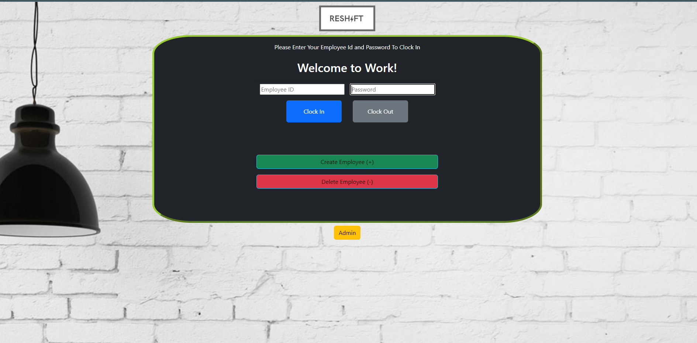

# reShift

## Table of Contents 

- [Description](#description)
- [Application-Photo](#application-photo)
- [Installation](#installation)
- [Usage](#usage)
- [User-Story](#user-story)
- [Change-Log](#change-log)
- [technologies](#technologies)
- [License](#license)

---

## Project Description 

For this project we are creating an application to be used by companies for their managers and employees. This puts a system in place that allows for Feedback from the employees to go directly to corporate or the store owners on management, operations, scedualing and other possible recommendations a company or management can use to better suit everyday employees. Our Projects are on display via Github, with clickable images as well as my resume in a clickable PDF file. 

---

### Application Photo


---

## Installation

To view the project, clone the git repository using VS Code. 
<!-- Link to deployed website: need deployed url -->

---

### Usage & Mock Up

Video Demo:


---

## User Story
```
AS A Company
I WANT a system in place for workers that clock in that allow them to share data on how they feel and have recommandation on how to better the system
SO THAT my Company can be inclusive and successful, as well as a great place to work.
```
---


## Change Log
## v1.1.5.

- Adding File skeleton
- Adding READ ME Changes

---

## Technologies

- HTML
- CSS
- Javascript
- React


---

## Deployed

https://reshift-servermonks.herokuapp.com/

## License

[github link: korbynd23](https://github.com/korbynd23)

Copyright (c) 2022 Korbyn Dicari, Tyler Neal, Nicholas Bales, Lawrence Carr & Bradley Meyer

Permission is hereby granted, free of charge, to any person obtaining a copy of this software and associated documentation files (the "Software"), to deal in the Software without restriction, including without limitation the rights to use, copy, modify, merge, publish, distribute, sublicense, and/or sell copies of the Software, and to permit persons to whom the Software is furnished to do so, subject to the following conditions:

The above copyright notice and this permission notice shall be included in all copies or substantial portions of the Software.

THE SOFTWARE IS PROVIDED "AS IS", WITHOUT WARRANTY OF ANY KIND, EXPRESS OR IMPLIED, INCLUDING BUT NOT LIMITED TO THE WARRANTIES OF MERCHANTABILITY, FITNESS FOR A PARTICULAR PURPOSE AND NONINFRINGEMENT. IN NO EVENT SHALL THE AUTHORS OR COPYRIGHT HOLDERS BE LIABLE FOR ANY CLAIM, DAMAGES OR OTHER LIABILITY, WHETHER IN AN ACTION OF CONTRACT, TORT OR OTHERWISE, ARISING FROM, OUT OF OR IN CONNECTION WITH THE SOFTWARE OR THE USE OR OTHER DEALINGS IN THE SOFTWARE.
